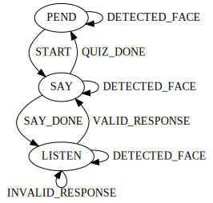
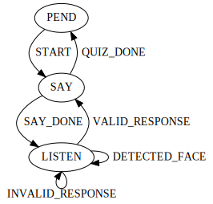

# Programming a reactive social robot program as a finite state machine

In this post, I'll show you how to implement a reactive social robot program as a [finite state machine](https://en.wikipedia.org/wiki/Finite-state_machine).
We'll continue from where we left off in the previous post [Programming a social robot using Cycle.js](./programming_socialrobot_with_cyclejs.md)--so check it out if you haven't already!
In case you are in a hurry, here is the [demo](https://stackblitz.com/edit/cycle-robot-drivers-tutorials-02-fsm) and [complete code](../examples/tutorials/02_fsm) of what we are building in this post.

<!-- If you want to take a peek at the complete code or demo
If you just want to check out the complete code or demo, [both are available](https://stackblitz.com/edit/cycle-robot-drivers-tutorials-02-fsm) at Stackblitz -->

## Making "travel personality quiz" program more complex

In the previous post, we programmed a [tablet-face robot](https://github.com/mjyc/tablet-robot-face) to test your travel personality.
Concretely, we implemented a tablet-face robot program that

1. looks at a person when it sees one and
1. asks travel personality quiz questions as shown in [this flowchart](http://www.nomadwallet.com/afford-travel-quiz-personality/)

as a [Cycle.js](https://cycle.js.org/) application.
Here are the [demo](https://stackblitz.com/edit/cycle-robot-drivers-tutorials-01-personality-quiz) and [complete code](../examples/tutorials/01_personality_quiz) from the previous post.

**IMPORTANT!!** The main package we use in the demo and in this post, [cycle-robot-drivers/run](../run), only works on Chrome browsers  (>= 65.0.3325.181) for now.

Now, what if we want the robot

1. look at a person only when the robot is waiting for a person's response,
1. stop asking a question if the robot cannot see a person and resume asking the question if it sees a person again, and
1. stop asking questions completely if a person abandons the robot, i.e., the robot does not see a person for more than 10 seconds.

How difficult would it be to update the existing program to have these additional behaviors?
Try implementing the new behaviors on top of the [travel personality quiz program](../examples/tutorials/01_personality_quiz/index.js)--what kind of challenges do you face?

From my experience, there were two major challenges; clearly expressing the desired robot behavior and implementing the desired behavior in a reactive programming framework.
In the rest of this post, I'll first demonstrate using a finite state machine to express a complex desired behavior.
Then I'll present a pattern for implementing a finite state machine in a reactive programming framework Cycle.js without scarifying maintainability.
<!-- To address the first challenge, we'll use a finite state machine for its simplicity.
For the second challenge, I'll present a pattern for implementing a finite state machine in a reactive programming framework [Cycle.js](https://cycle.js.org/) without scarifying maintainability. -->


## What is a finite state machine?

A [finite state machine (FSM)](https://en.wikipedia.org/wiki/Finite-state_machine) is a computational model that can be used to represent and control execution flow.
Due to their simplicity, FSMs have been frequently used by [roboticists](http://wiki.ros.org/smach), [UI developers](https://sketch.systems/) and many others for a [long](https://www.mtholyoke.edu/courses/pdobosh/cs100/handouts/genghis.pdf) [time](http://www.inf.ed.ac.uk/teaching/courses/seoc/2005_2006/resources/statecharts.pdf). An FSM we are using in this post is comprised of five parts:

1. A set of states, e.g., `'SAY_SENTENCE'`, `'WAIT_FOR_RESPONSE'`, etc.
1. A set of variables, e.g., `currentSentence = 'Can you see yourself working online?'`
1. A set of inputs: e.g., `VALID_RESPONSE`, `INVALID_RESPONSE`, etc.
1. A set of outputs: e.g., `speechSynthesisAction = 'Can you see yourself working online?'`
1. A transition function that takes a state, variable, and input and returns a state, variable, and output.

If you are familiar with FSMs, the FSM we are using is a [mealy machine](https://en.wikipedia.org/wiki/Mealy_machine) extended with variables.
Like a mealy machine, it has the following constraints:

* the state set is a [finite set](https://en.wikipedia.org/wiki/Finite_set)
* the FSM can only be in one state in the state set
* the transition function is deterministic; given a state, variable, and input the function always returns the same new state, new variable, and new output.


## Representing the "travel personality quiz" program as an FSM

We'll start from representing the ["travel personality test" program](../examples/tutorials/01_personality_quiz/index.js) we implemented in the previous post as an FSM:



Here we have three states, `PEND`, `SAY`, `LISTEN`, and five input types, `START`, `SAY_DONE`, `VALID_RESPONSE`, `INVALID_RESPONSE`, and `DETECTED_FACE`.
We omitted variables associated with each state and outputs associated with each transition for visual clarity.

Notice that we use verbs as state names (as a popular robotics FSM library [SMACH](http://wiki.ros.org/smach) does).
This is because we define the states based on distinct actions each state is performing, which are triggered by outputs emitted from transitions.
We did not make each state in the [travel quiz flowchart](http://www.nomadwallet.com/afford-travel-quiz-personality/) as an individual state.
This is because we represent all states that behave the same except the sentence the robot says at a state, which we factor out as the variable `currentSentence` (not shown in the diagram), with the single `SAY` state to make the FSM compact.
We represent the input in similar manner by representing it as a type-value pair.
For example, the `LISTEN` to `SAY` transition will update the `currentSentence` variable appropriately based on the value of the `VALID_RESPONSE` type input which can be "yes" or "no" (input values are not shown in the graph).

Now, let's update the FSM to express the first additional behavior mentioned above: looking at a person only when the robot is waiting for a person's response.



All we did here is removing the two self-loop transitions from the `PEND` and `SAY` states to stop the robot from looking at a person while the FSM is in those states.

<!-- I'll leave updating this FSM to support the other two additional behaviors as an exercise.
Try it! -->


## Implementing the "travel personality test" FSM using Cycle.js

Let's now implement the "travel personality test" FSM we defined above using Cycle.js.

First, we'll try to define the FSM in javascript as follows:

```js
const State = {
  PEND: 'PEND',
  SAY: 'SAY',  //_SENTENCE
  LISTEN: 'LISTEN',  //_FOR_RESPONSE
};

const InputType = {
  GOAL: `GOAL`,
  SAY_DONE: `SAY_DONE`,
  // QUIZ_DONE: is not an input type but a transition
  VALID_RESPONSE: `VALID_RESPONSE`,
  INVALID_RESPONSE: `INVALID_RESPONSE`,
  DETECTED_FACE: `DETECTED_FACE`,
};

function transition(state, variables, input) {  // a dummy transition function
  const newState = state;
  const newVariables = variables;
  const newOutputs = null;
  return {
    state: newState,
    variables: newVariables,
    outputs: newOutputs,
  };
}

/**
 * // Example state, variables, input, and outputs
 * const state = State.PEND;
 * const variables = {  
 *   sentence: 'You are a vacationer!',
 * };
 * const input = {
 *   type: InputType.GOAL,
 *   value: null,
 * };
 * const outputs = {
 *   SpeechSynthesisAction: {
 *     goal: 'You are a vacationer!'
 *   },
 *   SpeechRecognitionAction: {
 *     goal: {}
 *   },
 *   TabletFace: {
 *     goal: {
 *       type: 'SET_STATE',
 *       value: {
 *         leftEye: {x: 0.5, y: 0.5},
 *         rightEye: {x: 0.5, y: 0.5},
 *       },
 *     }},
 *   },
 * }
 */
```

Here we define the set of states `State`, the set of input types `InputType`, and the transition function `transition`
The sets for the variables and outputs of the FSM are not explicitly defined, but I provided example values that the variables and outputs can take in the comment.

We'll now setup the FSM as a Cycle.js application.
Like before, create a folder:

```
mkdir my-second-robot-program
cd my-second-robot-program
```

Then download [`package.json`](../examples/tutorials/02_fsm/package.json), [`.babelrc`](../examples/tutorials/02_fsm/.babelrc), [`index.html`](../examples/tutorials/02_fsm/index.html) and create an empty `index.js` file in the folder.
Run `npm install` to install the required npm packages.
After installing, you can run `npm start` to build and start the web application that does nothing.

Now add the following code in `index.js`:

```js
import xs from 'xstream';
import {runRobotProgram} from '@cycle-robot-drivers/run';

const State = {
// ...
const InputType = {
// ...
function transition(state, variables, input) {  // a dummy transition function
// ...

function input(  // a dummy input function
  start$,
  speechRecognitionActionResult$,
  speechSynthesisActionResult$,
  poses$,
) {  // a dummy input function
  return xs.never();
}

function output(machine$) {  // a dummy input function
  return {
    SpeechSynthesisAction: xs.never(),
    SpeechRecognitionAction: xs.never(),
    TabletFace: xs.never(),
  };
}

function main(sources) { 
  const input$ = input(
    sources.TabletFace.load,
    sources.SpeechSynthesisAction.result,
    sources.SpeechRecognitionAction.result,
    sources.PoseDetection.poses,
  );

  const defaultMachine = {
    state: State.PEND,
    variables: {
      sentence: null,
    },
    outputs: null,
  };
  const machine$ = input$.fold((machine, input) => transition(
    machine.state, machine.variables, input
  ), defaultMachine);

  const sinks = output(machine$);
  return sinks;
}

runRobotProgram(main);
```

If you run the application, it should load a robot face that does nothing on your browser. Yay~

The most important thing to notice here is that we divide the `main` function into three functions; `input`, `transition`, and `output`.
The `input` function takes incoming streams in `sources` and returns a stream that emits the FSM's input values.
We then use the [`fold`](https://github.com/staltz/xstream#fold) xstream operator on the returned stream (`$input`) to trigger the FSM's `transition` function.
Note that the `fold` operator is like `Array.prototype.reduce` for streams; it takes 

1. an accumulator function that takes an emitted value (e.g., a FSM input value, `input`) and a previous output of the accumulator function (e.g., the latest FSM, `machine`) or a seed value and
2. an initial output of the accumulator function (e.g., the initial FSM, `defaultMachine`).

Finally the `output` function takes the stream that emits FSMs (`$machine`) and returns outgoing streams.

<!-- If you are familiar with [Cycle.js' Model-View-Intent pattern](https://cycle.js.org/model-view-intent.html), we have  -->

Let's implement the three function.
First, update the dummy `input` function to:

```js
// ...
const Response = {
  YES: 'yes',
  NO: 'no',
}

function input(
  start$,
  speechRecognitionActionResult$,
  speechSynthesisActionResult$,
  poses$,
) {
  return xs.merge(
    start$.mapTo({type: InputType.START}),
    speechRecognitionActionResult$
      .filter(result =>
        result.status.status === 'SUCCEEDED'
        && (result.result === Response.YES || result.result === Response.NO)
      ).map(result => ({
        type: InputType.VALID_RESPONSE,
        value: result.result,
      })),
    speechSynthesisActionResult$
      .filter(result => result.status.status === 'SUCCEEDED')
      .mapTo({type: InputType.SAY_DONE}),
    speechRecognitionActionResult$
      .filter(result =>
        result.status.status !== 'SUCCEEDED'
        || (result.result !== Response.YES && result.result !== Response.NO)
      ).mapTo({type: InputType.INVALID_RESPONSE}),
    poses$
      .filter(poses =>
        poses.length === 1
        && poses[0].keypoints.filter(kpt => kpt.part === 'nose').length === 1
      ).map(poses => {
        const nose = poses[0].keypoints.filter(kpt => kpt.part === 'nose')[0];
        return {
          type: InputType.DETECTED_FACE,
          value: {
            x: nose.position.x / 640,  // max value of position.x is 640
            y: nose.position.y / 480,  // max value of position.y is 480
          },
        };
      }),
  );
}
// ...
```

Try testing whether the `input` function is behaving properly.
For example, you can attach the [`addListener`](https://github.com/staltz/xstream#addListener) xstream operator to the returned `$input` stream and return some outgoing streams from the `output` function.
Like this:

```js
// ...
import delay from 'xstream/extra/delay'
function output(machine$) {
  return {
    SpeechSynthesisAction: xs.of('Hello world!').compose(delay(1000)),
    SpeechRecognitionAction: xs.of({}).compose(delay(1000)),
    TabletFace: xs.never(),
  };
}

function main(sources) { 
  const input$ = input(
    sources.TabletFace.load,
    sources.SpeechSynthesisAction.result,
    sources.SpeechRecognitionAction.result,
    sources.PoseDetection.poses,
  );
  input$.addListener({next: value => console.log('input', value)})
// ...
```

Do you see expected outputs on your browser console?

Let's now remove the dummy `transition` function and create a new one:

```js
// ...
const State = {
// ...
const InputType = {
// ...
// // Remove the dummy transition function
// function transition(state, variables, input) {  // a dummy transition function
// ...
const Response = {
// ...
function input(
// ...

function createTransition() {
  const Sentence = {
    CAREER: 'Is it important that you reach your full career potential?',
    ONLINE: 'Can you see yourself working online?',
    FAMILY: 'Do you have to be near my family/friends/pets?',
    TRIPS: 'Do you think short trips are awesome?',
    HOME: 'Do you want to have a home and nice things?',
    ROUTINE: 'Do you think a routine gives your life structure?',
    JOB: 'Do you need a secure job and a stable income?',
    VACATIONER: 'You are a vacationer!',
    EXPAT: 'You are an expat!',
    NOMAD: 'You are a nomad!',
  };

  const flowchart = {
    [Sentence.CAREER]: {
      [Response.YES]: Sentence.ONLINE,
      [Response.NO]: Sentence.FAMILY,
    },
    [Sentence.ONLINE]: {
      [Response.YES]: Sentence.NOMAD,
      [Response.NO]: Sentence.VACATIONER,
    },
    [Sentence.FAMILY]: {
      [Response.YES]: Sentence.VACATIONER,
      [Response.NO]: Sentence.TRIPS,
    },
    [Sentence.TRIPS]: {
      [Response.YES]: Sentence.VACATIONER,
      [Response.NO]: Sentence.HOME,
    },
    [Sentence.HOME]: {
      [Response.YES]: Sentence.EXPAT,
      [Response.NO]: Sentence.ROUTINE,
    },
    [Sentence.ROUTINE]: {
      [Response.YES]: Sentence.EXPAT,
      [Response.NO]: Sentence.JOB,
    },
    [Sentence.JOB]: {
      [Response.YES]: Sentence.ONLINE,
      [Response.NO]: Sentence.NOMAD,
    },
  };

  const transitionTable = {
    [State.PEND]: {
      [InputType.START]: (variables, inputValue) => ({
        state: State.SAY,
        variables: {sentence: Sentence.CAREER},
        outputs: {SpeechSynthesisAction: {goal: Sentence.CAREER}},
      }),
    },
    [State.SAY]: {
      [InputType.SAY_DONE]: (variables, inputValue) => (
          variables.sentence !== Sentence.VACATIONER
          && variables.sentence !== Sentence.EXPAT
          && variables.sentence !== Sentence.NOMAD
        ) ? {  // SAY_DONE
          state: State.LISTEN,
          variables,
          outputs: {SpeechRecognitionAction: {goal: {}}},
        } : {  // QUIZ_DONE
          state: State.PEND,
          variables,
          outputs: {done: true},
        },
    },
    [State.LISTEN]: {
      [InputType.VALID_RESPONSE]: (variables, inputValue) => ({
        state: State.SAY,
        variables: {sentence: flowchart[variables.sentence][inputValue]},
        outputs: {
          SpeechSynthesisAction: {
            goal: flowchart[variables.sentence][inputValue],
          },
          TabletFace: {goal: {
            type: 'SET_STATE',
            value: {
              leftEye: {x: 0.5, y: 0.5},
              rightEye: {x: 0.5, y: 0.5},
            },
          }},
        },
      }),
      [InputType.INVALID_RESPONSE]: (variables, inputValue) => ({
        state: State.LISTEN,
        variables,
        outputs: {SpeechRecognitionAction: {goal: {}}},
      }),
      [InputType.DETECTED_FACE]: (variables, inputValue) => ({
        state: State.LISTEN,
        variables,
        outputs: {
          TabletFace: {goal: {
            type: 'SET_STATE',
            value: {
              leftEye: inputValue,
              rightEye: inputValue,
            },
          }},
        }
      }),
    },
  };

  return function(state, variables, input) {
    return !transitionTable[state]
      ? {state, variables, outputs: null}
      : !transitionTable[state][input.type]
        ? {state, variables, outputs: null}
        : transitionTable[state][input.type](variables, input.value);
  }
}

const transition = createTransition();

function output(machine$) {  // a dummy input function
// ...
```

Here we define and return the FSM's transition function inside the `createTransition` function.
Can you see the FSM we defined above in this function?

Finally update the dummy `output` function to:

```js
// ...
const transition = createTransition();

function output(machine$) {
  const outputs$ = machine$
    .filter(machine => !!machine.outputs)
    .map(machine => machine.outputs);

  return {
    SpeechSynthesisAction: outputs$
      .filter(outputs => !!outputs.SpeechSynthesisAction)
      .map(output => output.SpeechSynthesisAction.goal),
    SpeechRecognitionAction: outputs$
      .filter(outputs => !!outputs.SpeechRecognitionAction)
      .map(output => output.SpeechRecognitionAction.goal),
    TabletFace: outputs$
      .filter(outputs => !!outputs.TabletFace)
      .map(output => output.TabletFace.goal),
  };
}

function main(sources) {
// ...
```

Try running the application and test whether it behave as we defined in the FSM.

You just implemented a social robot program as an FSM!
