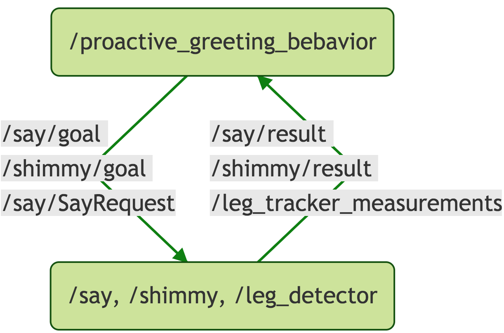

## Reactive Programming for Robot Applications

### Michael Jae-Yoon Chung

#### ROS Seattle Meetup, 2019/03/27

---

<a href="https://spectrum.ieee.org/automaton/robotics/robotics-hardware/indoor-robots-for-commercial-spaces">
  
</a>


Note:

Robots are making appearances in our lives.
Today, robots in commercial spaces are providing services such as security, delivery, and inventory monitoring.

---

<a href="https://www.sciencefocus.com/future-technology/cozmos-robot-character-hides-healthcare-payload/">
  
</a>
<a href="https://variety.com/2017/digital/news/amazon-echo-show-alexa-calling-1202421062/">
  
</a>


Note:

At home, we have toy robots like Anki Cozmo and smart assistant devices like Amazon echoshow that entertain us or provide useful information to us.

---

<a href="http://www.savioke.com/blog/2017/6/22/new-interfaces-enable-relay-users-to-significantly-expand-and-improve-robot-capabilities-and-services">
  
</a>
<a href="https://www.trustedreviews.com/news/toy-of-the-year-3325584">
  
</a>


Note:

One common aspect of all these robots in human-environment is that they are constantly interacting with the environment including humans.
To make such robots more usable, building interactive applications that are robust and easy to maintain have become critical.

---

## Challenges

* Uncertainty
* Temporailty <!-- .element: class="fragment" -->
* Concurrency <!-- .element: class="fragment" -->


Note:

However, programming such applications is not trivial because handling perception or actuation uncertainty is challenging for programmers.
Even when programmers can assume robust robot perception and control, getting temporality right in interactive applications is not trivial.
Another related challenge is handling concurrency issues, which often emerge when working with multi-model interaction interfaces or asynchronous processes, e.g. a central control system.

---

## Challenges

* Uncertainty
* Temporailty
* Concurrency <!-- .element: class="fragment grow" -->


Note:

In this talk, I will focus on proposing an architecture that is intended to enable non-roboticist programmers, primarily web developers, to program robot applications easily.
I find the problem of finding an architecture that handles uncertainty or temporality issues not as interesting because (i) I'm not fully convinced whether the end-user programmers should be working with probabilities directly and (ii) the concurrency issues seem to subsume the temporality issues I've faced so far.

---

## Cycle.js + ROS


Note:

I propose using a web development framework based called Cycle.js with ROS for building interactive robot applications.

---

## What is [Cycle.js](http://cycle.js.org)?

* [functional and reactive programming](http://conal.net/papers/icfp97/) framework in JavaScript
* abstraction that separates [side-effect](https://bit.ly/2dSGoZF) producing code from the main business logic code so the main code remains [pure](https://en.wikipedia.org/wiki/Pure_function) and predictable.


Note:

What is Cycle.js?
It is a functional and reactive programming framework in JavaScript that allows programmers to express system behaviors as orchestrations of dataflow instead of imperative flows of controls.
The framework also enforces programmers to separate side-effect producing code from the main business logic code to keep the main code pure and hence more predictable.

---




Note:

Let's try to understand what that means from what we know; creating a program in ROS.
Imagine how you would program a greeting robot behavior that proactively greets a person depends on distance-to-person in ROS.
I would write a new ROS node that implements the desired behavior by subscribing to topics from existing perception nodes and publishing topics to the existing control nodes.
For example, ...

```mermaid
graph TD
A( /greeting_behavior ) -->| /move_base/goal, <br> /sound_play/SoundRequest| B
B( /move_base, /leg_detector, /sound_play ) -->| /move_base/result <br> /leg_tracker_measurements | A

{
  "theme": "forest"
}
```

https://mermaidjs.github.io/mermaid-live-editor/

---

New specifications:

* notify the server on certain events
* coordinate text-to-speech and base-movement


Note:

The concurrency issues I pointed out earlier usually occur in the behavior node as soon as the desired behavior becomes more complex.
Let's say we have additional specifications such as the robot needs to notify to the central control system for logging purpose or the robot needs to coordinate text-to-speech and base movement to make its internal state more transparent.
Now you are facing nontrivial decisions to make such as where to place notification trigger and trigger event definition location, e.g., in a new node vs. in the behavior node, and a way to synchronize speech and movement related logic.
In addition, due to the increased number of the system's concurrent inputs and outputs, we are also likely to have race-condition related bugs in our code.

---


`sinks = main(sources)` <!-- .element: class="fragment" data-fragment-index="1" -->

`sources = Drivers(sinks)` <!-- .element: class="fragment" data-fragment-index="1" -->


Note:

The Cycle.js proposes an architecture that considers all components as functions that process to input data streams and returns output data streams, e.g., data streams could carry control signals or sensor data, and enforces separating components that produce side-effects from the behavior logic.
Then running an application means setting up cyclic dependencies between two groups of components: mains and drivers.

---

## ROS APIs as Cycle.js Drivers

```
{subscribedTopics} = ROSTopicDriver({publishedTopics});

{response} = ROSServiceDriver({request});

{latestValue1, ...} = ROSParamDriver({newValue1, ...});
```
<!-- .element: style="font-size: 0.55em" -->

See [cycle-ros-example](https://github.com/mjyc/cycle-ros-example) github repo for details.


Note:

Let's see how we can use ROS inside of a Cycle.js application.
I propose exposing ROS APIs, topics, services, and params, as Cycle.js drivers. For the topic API, we can a Cycle.js driver that takes data streams and returns data streams, which are corresponding to published and subscribed from a Cycle.js application.
For the service API, we can a Cycle.js driver that takes data streams of service requests and returns data streams of service responses.

I believe exposing ROS APIs as Cycle.js drivers is a natural way of bridging the two frameworks since ROS is already using data streams for communication purposes and accessing ROS via Cycle.js' drivers fits the Cycle.js' pattern as many ROS nodes make side effects.

---

<iframe width="100%" height="600px" src="https://stackblitz.com/edit/ros-seattle-meetup-20190328?embed=1&file=proactiveGreetingsApp.js&view=editor"></iframe>


Note:

Let's implement the proactive greeting application I mentioned earlier in pseudo code as a demo.

_Cover_
1. the overall structure
2. the main function
3. the extended examples, e.g., using faceId

Imagine how you would implement this behavior in ROS.

---

Check out [cycle-robot-drivers](https://github.com/mjyc/cycle-robot-drivers) github repo for more drivers and example applications!

<iframe width="100%" height="400px" src="https://stackblitz.com/edit/ros-seattle-meetup-20190328?embed=1&file=index.js"></iframe>


Note:

_Demo the eye following app and mention that they can try it using online IDE; no need to install libraries on your computer_

---

## Potential Applications

* Interactive manipulation <!-- .element: class="fragment" -->
* Environment-aware navigation <!-- .element: class="fragment" -->
* Social robot behaviors <!-- .element: class="fragment" -->


Note:

Reducing fractions to creating interactive application opens door to making a wide range of robot application more interactive.

---

## Related Work

* [Functional Reactive Animation - ICFP97](http://conal.net/papers/icfp97/)
* [Yampa - 2002](https://wiki.haskell.org/Yampa)
* ["Reactive ROS" topic in ROS discourse](https://discourse.ros.org/t/reactive-ros/)
* [Playful](https://playful.is.tuebingen.mpg.de)


Note:

Taking a reactive programming approach to implementing interactive application has a long history.

---

## Future Work

* Adapting the pattern in python or cpp via [ReactiveX](http://reactivex.io/)
* More robotics tool supports for web developers, e.g., [recording](https://codesandbox.io/s/9lyowx5q0y) and [replaying](https://codesandbox.io/s/48oozw2qz7) data


Note:

Encourage ROS users to try reactive programming.
Encourage web developers to program robots / use ROS.

---

## Conclusion

* Cycle.js + ROS as a reactive programming solution for robot applications
* Use-case demonstrations
* Try reactive programming in your next project!

---

## More Reading

* [Programming a social robot using Cycle.js](https://dev.to/mjyc/programming-a-social-robot-using-cyclejs-23jl)
* [Implementing a finite state machine in Cycle.js](https://dev.to/mjyc/implementing-a-finite-state-machine-in-cyclejs-1e63)
